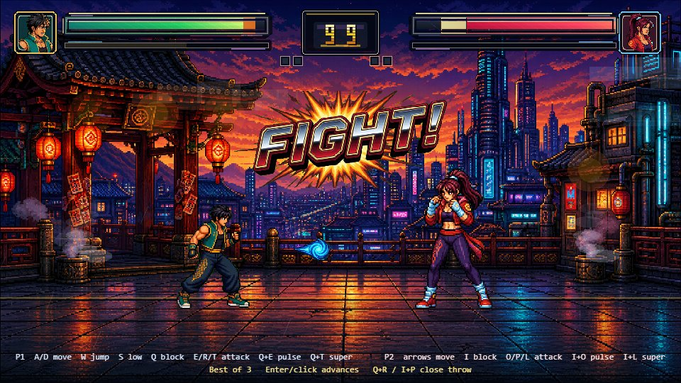

# Neon Dojo · 8-Bit Fighting

A Tekken-inspired retro pixel fighting game. Eleven fighters — **Kai**, **Nova**, the **Dragon Warrior** (Zalama-themed dragon god), **Talon** the eagle warrior, **Ryu**, **Kara**, **Blaze**, **Cyberon**, **Shadow**, **Luna** and **Titan** — best-of-3 rounds on a neon-dusk rooftop dojo. Every sprite, portrait, stage, word-art, sound effect and music track was AI-generated (ComfyUI: Qwen-Image, Stable Audio Open, ACE-Step; the Dragon Warrior via GPT Image 2) and wired into a hand-built Phaser engine.



## Controls

| | P1 | P2 |
|---|---|---|
| Move | A / D | ← / → |
| Jump | W | ↑ |
| Crouch | S | ↓ |
| Block | Q | I |
| Light / Heavy / Kick | E / R / T | O / P / L |
| Pulse (projectile) | Q+E | I+O |
| Overdrive (super) | Q+T | I+L |
| Throw | Q+R | I+P |

Double-tap left/right to dash. Enter / click advances rounds. Best of 3. Character-select cycles through all 11 fighters (A/D for P1, ←/→ for P2).

## Tech

- **Phaser 3 + TypeScript + Vite**, 960×540 canvas, no external assets beyond the generated packs.
- Full fight system: walk/run/jump/crouch, light/heavy/kick + crouch attacks, throws, projectile special + metered super, blocking with chip damage, hit/crouch-hit/air-hit reactions, knockdown → wake → KO flow, rounds, timer, victory poses.
- ~30 animation states per fighter, animated projectiles with impact bursts, arcade word-art (ROUND / FIGHT! / K.O. / PERFECT / TIME OVER), generated HUD.
- 13 generated SFX + 3 music tracks (battle loop, menu loop, victory sting) with a WebAudio synth fallback.

## Local AI asset pipeline

All art and audio is produced by scripts against a local ComfyUI instance (RTX GPU):

- `scripts/comfy-generate.py` — text→image or reference-conditioned image (keeps fighters on-model)
- `scripts/slice-state-strips.py` — chroma-key strips → aligned per-frame sprites (island detection, aura-bridge splitting, scale normalization)
- `scripts/slice-vfx-strip.py` — projectile / burst / word-art slicing
- `scripts/comfy-audio.py` + `scripts/batch-generate-audio.py` — SFX (Stable Audio Open) and music (ACE-Step)
- `scripts/batch-generate-states.py` — full generate→slice→retry loop for character states

## Development

```bash
npm install
npm run dev              # local dev server
npm run build            # production build to dist/
npm run test:animation   # Playwright suite (once: npx playwright install chromium-headless-shell)
```

## Deploying

Cloudflare Pages:

- Framework preset: `Vite`
- Build command: `npm run build`
- Build output directory: `dist`

or directly: `npx wrangler pages deploy dist --project-name=<name>`
# fighting-game
